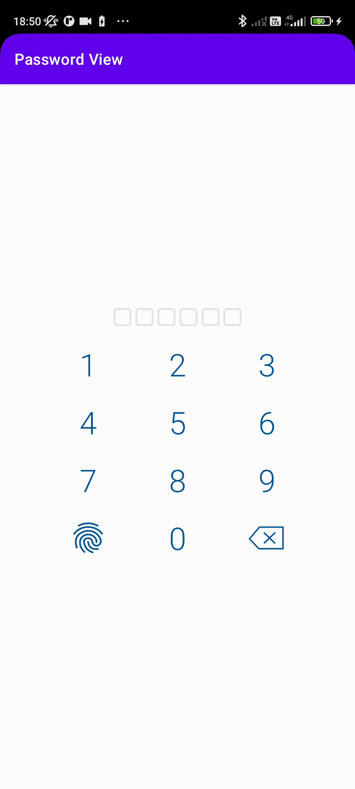

# Password Keyboard



### Aviable options:
```app:passwordLength``` - length of your password (from 4 to 8 characters ,default 4)\
```app:openBiometryOnLoad``` - If true - opens biometry dialog on load (default true)\

### How to use
Add this code to your layout
```xml
    <ru.korshun.passwordviewlayout.PasswordViewLayout
        android:id="@+id/passwordViewLayout"
        android:layout_width="match_parent"
        android:layout_height="wrap_content"
        app:passwordLength="6"/>
```
Your Activity or Fragment must implement OnEnterPasswordListener interface:
```kotlin
    override fun getPassword(s: String) {
        // gets a password after input
        // your logic here
    }
```
Send listener:
```kotlin
mPasswordViewLayout?.setOnEnterPasswordListener(this)
```
Declare biometry authentication callback and send it:
```kotlin
        val authenticationCallback = object : BiometricPrompt.AuthenticationCallback() {
            override fun onAuthenticationError(errorCode: Int,
                                               errString: CharSequence) {
                super.onAuthenticationError(errorCode, errString)          
                    Toast.makeText(applicationContext,
                        "Authentication error: $errString", Toast.LENGTH_SHORT)
                        .show()
            }

            override fun onAuthenticationSucceeded(result: BiometricPrompt.AuthenticationResult) {
                super.onAuthenticationSucceeded(result)
                Toast.makeText(applicationContext,
                    "Authentication succeeded!", Toast.LENGTH_SHORT)
                    .show()
            }

            override fun onAuthenticationFailed() {
                super.onAuthenticationFailed()
                Toast.makeText(applicationContext, "Authentication failed",
                    Toast.LENGTH_SHORT)
                    .show()
            }
        }
        mPasswordViewLayout?.setAuthenticationCallback(authenticationCallback)
```
### License
```
MIT License

Copyright 2021

Permission is hereby granted, free of charge, to any person obtaining a copy 
of this software and associated documentation files (the "Software"), to deal 
in the Software without restriction, including without limitation the rights 
to use, copy, modify, merge, publish, distribute, sublicense, and/or sell 
copies of the Software, and to permit persons to whom the Software is 
furnished to do so, subject to the following conditions:

The above copyright notice and this permission notice shall be included in 
all copies or substantial portions of the Software.

THE SOFTWARE IS PROVIDED "AS IS", WITHOUT WARRANTY OF ANY KIND, EXPRESS OR 
IMPLIED, INCLUDING BUT NOT LIMITED TO THE WARRANTIES OF MERCHANTABILITY, 
FITNESS FOR A PARTICULAR PURPOSE AND NONINFRINGEMENT. IN NO EVENT SHALL 
THE AUTHORS OR COPYRIGHT HOLDERS BE LIABLE FOR ANY CLAIM, DAMAGES OR OTHER 
LIABILITY, WHETHER IN AN ACTION OF CONTRACT, TORT OR OTHERWISE, ARISING FROM,
OUT OF OR IN CONNECTION WITH THE SOFTWARE OR THE USE OR OTHER DEALINGS IN 
THE SOFTWARE.
```
